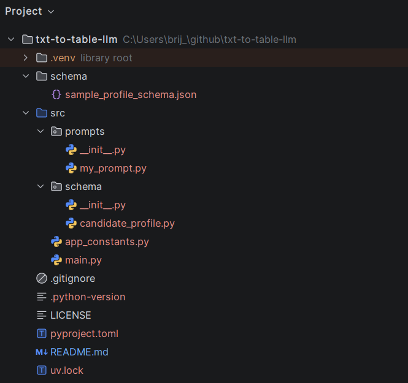

# Text-to-Table-LLM (TabularLLM)
## 📖 Overview
Text-to-Table-LLM is a sample project demonstrating how to use a Large Language Model (LLM) to convert unstructured text into structured tabular data.
The example implementation focuses on resume/profile parsing, extracting key candidate attributes into a well-defined JSON schema.

This prototype leverages Google Gemini, a cutting-edge LLM designed for natural language understanding and generation. Gemini is integrated to power AI agents, enabling advanced reasoning, conversational capabilities, and decision-making for data extraction tasks.

## 🚀 Features
Parse unstructured text (e.g., resumes, profiles).

Extract structured attributes into JSON schema format.

Convert JSON into tabular data (CSV, Excel, DataFrame).

Configurable schema for different domains.

Powered by LangChain orchestration + Google Gemini LLM.

## 🛠️ Tech Stack
Python 3.10+

LangChain for orchestration

Google Gemini LLM for semantic extraction

Pydantic for schema validation

Pandas for tabular conversion

## 📂 Project Structure


## ⚙️ Installation
```bash
git clone https://github.com/your-repo/text-to-table-llm.git
cd text-to-table-llm
uv init .
uv sync
```

## 📈 Future Work
Support for multi-document batch processing.

Integration with vector databases for semantic search.

Enterprise-grade pipeline with monitoring and logging.

API endpoints for real-time extraction.

## 📬 Contact
For technical guidance on building an enterprise-grade TabularLLM implementation, reach out at:
brij_joe@yahoo.com